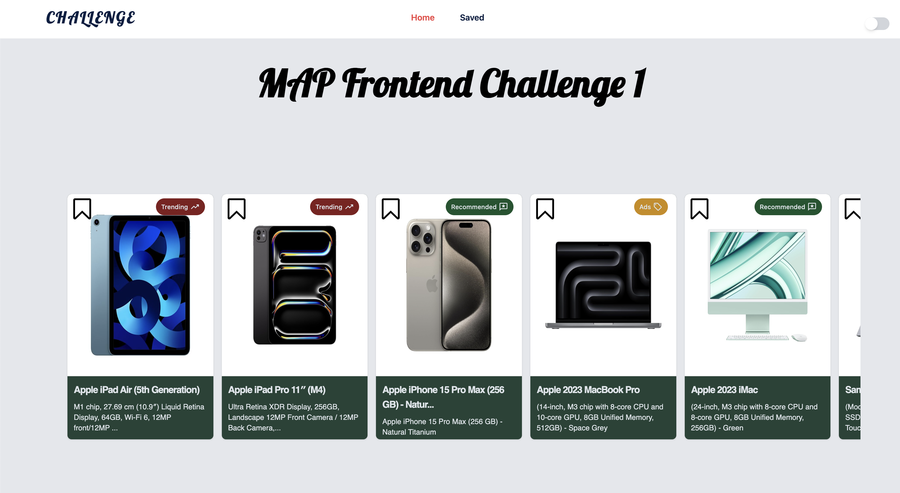
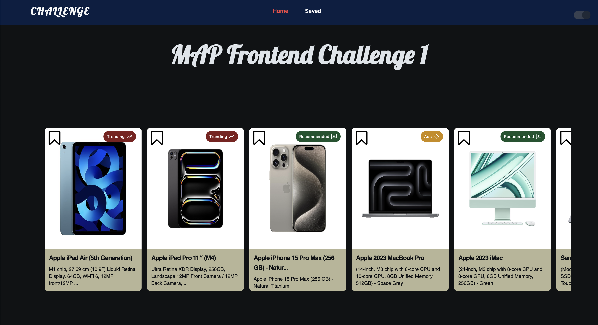
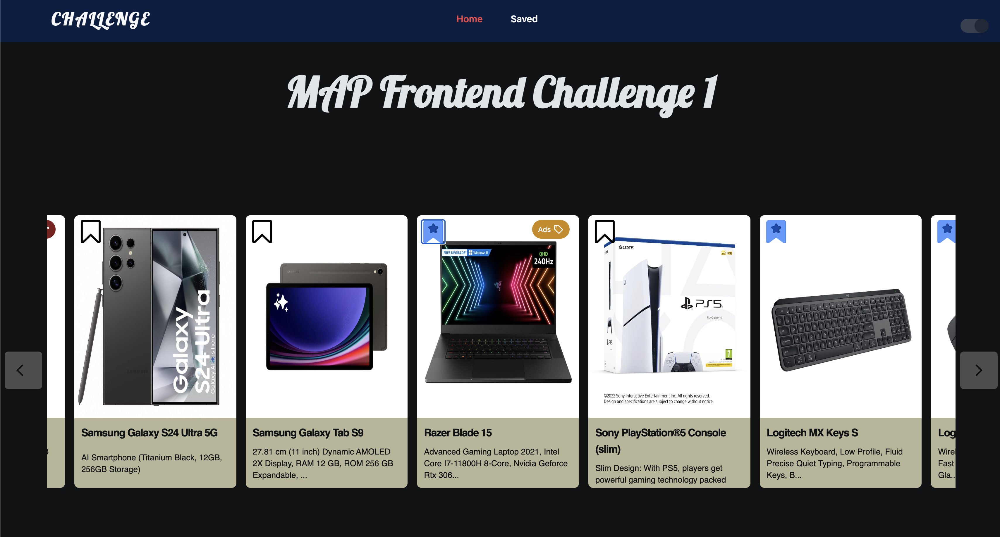
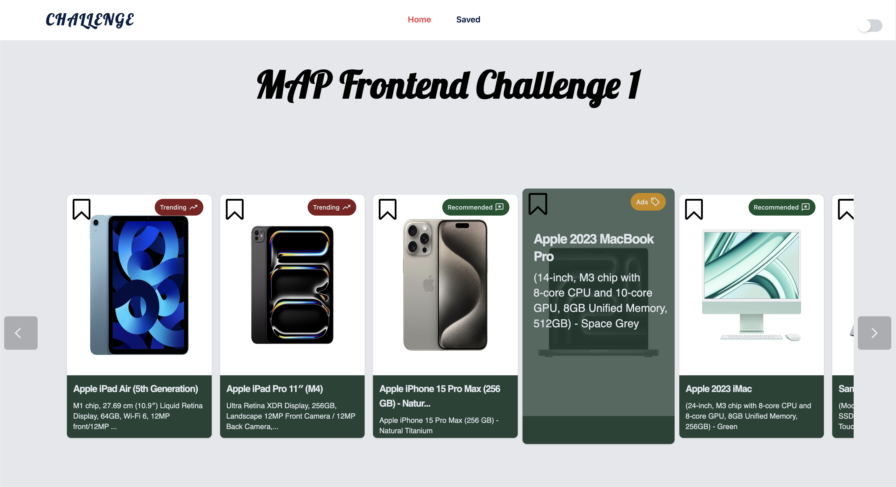
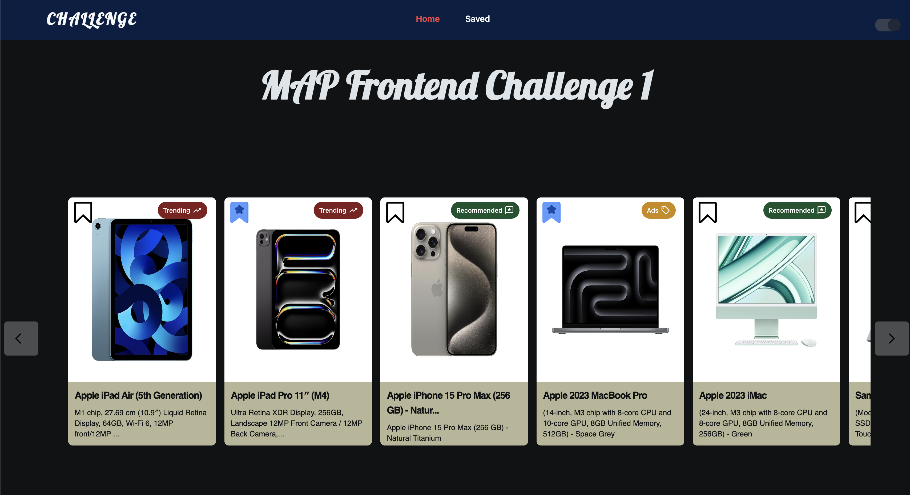
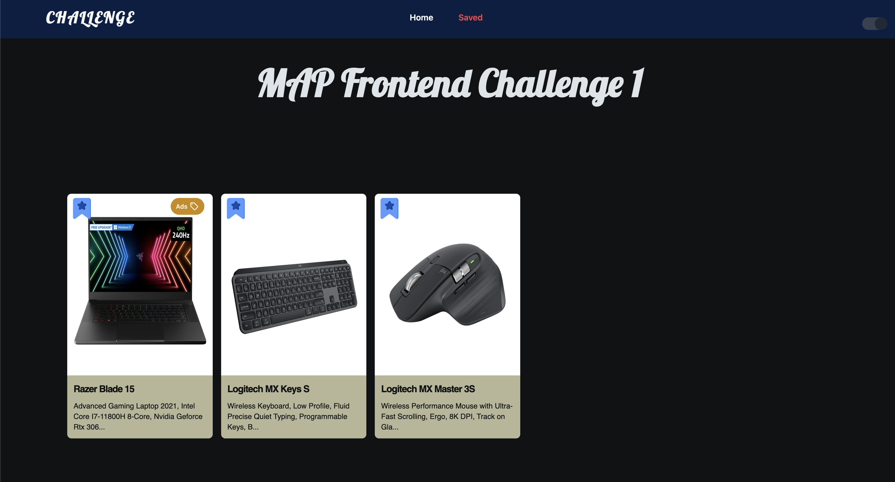

# MAP Frontend Challenge 01
## Links
[Github repo](https://github.com/Bharatchandran/MAP_Frontend_Challenge_01)
## Tech Stack 

- **React.js**: A powerful JavaScript library for building user interfaces.
- **Vite**: A fast and modern build tool for frontend development.
- **Tailwind CSS**: A utility-first CSS framework for creating custom designs quickly.
- **Redux Toolkit**: An opinionated toolset for efficient Redux development.

### Icon Resource
- Google Material Icons
### Fonts
- **Lobster**
- **Roboto**

## Key Features

- **Horizontal Smooth Scroll Card Drawer**: Navigate seamlessly through a horizontal card drawer.
- **Detailed Card View on Hover**: Get a closer look at cards with detailed views upon hovering.
- **Save Cards for Later**: Save cards with ease by selecting the save button on each card.
- **Dedicated Saved Card Section**: Access all saved cards conveniently in one dedicated section.


## Installation

### Create React Project

1. Create a new React project using `npm create vite@latest`.
2. Install required node modules with `npm install`.

### Tailwind Setup

1. Install Tailwind CSS, PostCSS, and Autoprefixer:
    ```bash
    npm install -D tailwindcss postcss autoprefixer
    ```
2. Initialize Tailwind configuration:
    ```bash
    npx tailwindcss init -p
    ```
3. Replace the content of `tailwind.config.js` with:
    ```javascript
    export default {
      content: [
        "./index.html",
        "./src/**/*.{js,ts,jsx,tsx}",
      ],
      theme: {
        extend: {},
      },
      plugins: [],
    }
    ```
4. Add the following to `index.css`:
    ```css
    @tailwind base;
    @tailwind components;
    @tailwind utilities;
    ```

5. Run the project using `npm run dev`.

### Additional Dependencies

- Install React Redux Toolkit and React Redux:
    ```bash
    npm i @reduxjs/toolkit
    npm i react-redux
    ```

## Screenshots
### Light mode

### Dark mode

### Loading screen

### Cursor on card drawer

### Hover card

### Responsive

### Saved for later (Home Screen)

### Collection of saved for later

